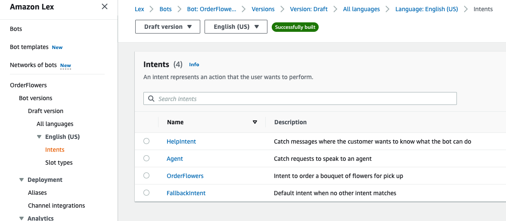
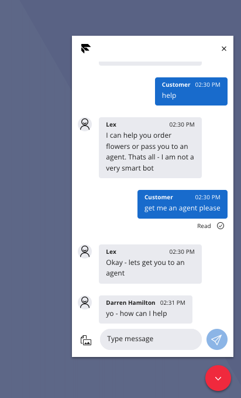

# Flex WebChat Integration to AWS Lex

## Disclaimer

**This software is to be considered "sample code", a Type B Deliverable, and is delivered "as-is" to the user. Twilio bears no responsibility to support the use or implementation of this software.**

## Supports Flex UI V1/Legacy Flex Chat using Programmable Chat

**For Flex Conversations the general patterns will still apply but the studio trigger examples and API requests would need changing for Flex Conversations. See the 'other considerations' section for details**

# Overview

This repo describes a couple of options on how to integrate Flex WebChat into AWS Lex and provides POC code for Twilio serverless Functions, AWS Lambdas and a Studio Flow.

After describing how to extend the AWS Lex 'Order Flowers' sample bot to include intent indicating 'Chat to Agent' we cover how to integrate the Twilio Flex WebChat widget with Lex.

Option 1 uses a Studio Flow combined with Twilio Functions approach and option 2 describes setting a Flex Flow to point to a Twilio Function and bypassing Studio.

Option 1 is self-contained within Twilio (Twilio Functions, Studio and Lex via AWS lex runtime sdk) whereas option 2 provides a more generic solution that splits the Programmable Chat Channel interaction implemented in Twilio and the Bot specific handling within AWS.

# AWS Lex OrderFlowers Bot Setup

This repo builds on the [OrderFlowers sample](https://docs.aws.amazon.com/lex/latest/dg/gs-bp.html). After building the sample bot and testing it out you can extend it as follows:

- Add an intent named _'Agent'_ with sample utterances phrases along the lines of below. Set the initial response message to something suitable such as _'Okay - lets get you to an agent'_
  - agent
  - talk to a person
  - etc
- Optionally add an intent named _'HelpIntent'_ with the message response along the lines of _'I can help you order flowers or pass you to an agent. Thats all - I am not a very smart bot'_

Once you have built and tested your bot note down the Bot Id and Bot Alias Id that will be used by the [lex-runtime sdk](https://docs.aws.amazon.com/AWSJavaScriptSDK/latest/AWS/LexRuntimeV2.html)

Now that the bot has been extended we will make use of the _'OrderFlowers'_ and _'Agent'_ intent names as follows:

- On _'Agent'_ intent we will send the chat to Flex
- On _'OrderFlowers'_ intent and state is _'ReadyForFulfillment'_ we will close the chat
- On all other intents just pass back any messages from Lex.

Both option 1 and 2 make use of the recognizeText aws lex runtime sdk method and use the response to determine the intent, state and message to reply back to the channel with.
A deeper dive into Lex is outside of the scope of this repo but the recongnizeText request/response is covered in detail [here](<(https://docs.aws.amazon.com/AWSJavaScriptSDK/latest/AWS/LexRuntimeV2.html#recognizeText-property)>)

For this simple POC we make use of the following response fields:

```
sessionState.intent.name
sessionState.intent.state
messages.[0].content (we assume only 1 message per turn)
sessionState.intent.slots
```



# Option 1 - Studio Integration

## Overview of solution

This solutions makes use of a [Twilio Function](studio-approach/serverless/functions/handleMessagesForBot.protected.js) to send customer messages to Lex and it returns the lex runtime recognizeText response to the [Studio Flow](studio-approach/studio-flow/studio-flow.json). The Studio Flow uses the [Send & Wait for Reply widget](https://www.twilio.com/docs/studio/widget-library/send-wait-reply) to send the Bot reply to the customer and waits for a reply message from the customer and will loop around calling the function and then Send & Wait for Reply. Note the Programmable Chat Channel Sid (CHxx) is used as the Lex Session Id.

If the _'Agent'_ intent is reached a [Send to Flex widget](https://www.twilio.com/docs/studio/widget-library/send-flex) is used. After the Send to Flex widget subsequent messages will just go into the programmable chat channel and be available for the agent rather than to the Bot.

Note in the case of _'OrderFlowers'_ and the _'ReadyForFulfillment'_ state a [Twilio Function](studio-approach/serverless//functions/readyForFulfillment.protected.js) is called which updates the programmable chat channels attributes to indicate _status=INACTIVE_ which signals to the Flex WebChat widget to close the chat

## Deploy

- [Deploy OrderFlowers bot](https://docs.aws.amazon.com/lexv2/latest/dg/aliases.html) and note the bot and alias id
- Add AWS user with lex runtime permissions policy for [Amazon Lex](https://docs.aws.amazon.com/lex/latest/dg/security-iam-awsmanpol.html)
- Rename the .env-template in serverless to .env and update the Twilio Sids, AWS credentials and AWS Bot Ids. Environment variables are covered in detail [here](https://www.twilio.com/docs/labs/serverless-toolkit/developing#environment-variables).
- Deploy the Twilio Serverless functions and note the twil.io domain name created. Deploying functions is covered in detail [here](https://www.twilio.com/docs/labs/serverless-toolkit/deploying).
- Create the [Studio Flow](https://www.twilio.com/docs/studio/user-guide/get-started#create-a-flow) from the [Studio Flow JSON](studio-approach/studio-flow/studio-flow.json) or replace the default Chat Flow if appropriate.
- Update the domain name in the Studio Flow in the first widget which sets a variable. This should be set to be the domain name from the deployed service, eg https://lex-serverless-studio-xxx-dev.twil.io
- If you have created a new Studio Flow you will need to create a Flex Flow to map the to Studio Flow as described [here](https://www.twilio.com/docs/flex/developer/messaging/manage-flows)

## Test it out!

We can make use of the demo of Flex WebChat:
https://demo.flex.twilio.com/chat?accountSid=ACxxx&flexFlowSid=FOxxx

Note you will need to add in your account sid and the Flex Flow Sid that is pointing to the Studio Flow deployed above.



## Suggested improvements to the solution

Note that whilst the Bot is processing the recognizeRequest the Twilio Function invocation is active as the request is blocking waiting for a response. It is recommended that Twilio Functions are used when the response time is relatively deterministic and short. This is to avoid having too many concurrent function invocations as the [default limit is 30](https://www.twilio.com/docs/serverless/api#limits)

Whilst the Twilio Functions could be replaced using another form of endpoint (AWS Lambda for example) arguably a non-blocking async pattern would be a better design. This is covered in option 2 below.

The Studio Flow is looking for specific intent names and this could be argued as being tightly coupled with the Lex implementation which also drives us to design decisions shown in option 2.

# Option 2 - Webhook Integration

## Overview

In option 1 using Studio we had a solution that would invoke a function that would execute until the bot responded and would then pass the raw response back to the Studio Flow. To ensure that function invocation time is kept to a minimum and to decouple the Twilio/Flex side of things from the Bot internals option 2 uses an async message approach and seperates Programmable Chat Channel handling from Bot handling.

A [Flex Flow with a webhook integration](https://www.twilio.com/docs/flex/developer/messaging/manage-flows#external-webhookhttp-request-widget) is first configured which will be triggered for all new messages from the customer. This webhook will send a webhook with the Channel sid and Message body to a Twilio Function [inboundChatMessageHandler](webhook-approach/serverless/functions/inboundChatMessageHandler.protected.js). This inbound message handler reads the channels attributes in to get the pre engagement data to retrieve the bot name and then does a HTTP post to an AWS Lambda which includes the message body and the Programmable Chat Channel Sid which the Bot will use as a session id.

The HTTP post from the inbound message webhook handler goes to the AWS Lambda [handleCustomerBotMessage](webhook-approach/aws-lambda/handleCustomerBotMessage.js). The Lambda just takes the bot name, message and channel/session id and enqueues it into an AWS Simple Queue Service ([SQS](https://aws.amazon.com/sqs/)). The Lambda then responds with an OK which terminates the inbound message handler Twilio function which ensures that it quickly responds to the message webhook without waiting for the bot response.

A second AWS Lambda [processCustomerBotMessageFromSQS](webhook-approach/aws-lambda/processCustomerBotMessageFromSQS.js) is configured to be triggered for each message added to the SQS. This Lambda uses the AWS [lex-runtime sdk](https://docs.aws.amazon.com/AWSJavaScriptSDK/latest/AWS/LexRuntimeV2.html) recognizeText method to wait for a response from Lex.
Once the response is received it does a HTTP post to the Twilio Function [outboundChatMessageHandler](webhook-approach/serverless/functions/outboundChatMessageHandler.js) which will add the response to the Programmable Chat Channel and depending if the Bot intent determines an agent is required or if the conversation can be considered fulfilled will process accordingly.

Note that the HTTP post to the outbound chat message handler has a nextStep parameter and the function will follow the logic below:

```
+ WAIT_FOR_MESSAGE: Add the Bot response to the channel and no further action needed. Subsequent replies from the customer will go back to the bot
+ CLOSE_CHAT: Update the Chat Channel Attributes status parameter to INACTIVE. This signals to the WebChat client that the conversation is completed
+ AGENT: Remove the webhook that is sending messages to the inbound chat handler which was added on channel create by the Flex Flow so that subsequent messages just go into the channel for the agent and not to the Bot. Create a TaskRouter Task referencing the Programmable Channel Sid to route the conversation to an agent
```

## Setup
1. Setup you Bot as described above to extend the OrderFlowers AWS Lex blueprint and note the Bot Id and the Bot Alias Id of the deployed Bot

   (If you are working with an existing Bot the solution should work as expected but you will have to update the AWS Lanmbda that processes the Bot response and map the Lex Intent to a suitable nextAction that is sent to the outbound chat message handler)
2. Add a standard AWS SQS via the console and name it 'inboundCustomerBotMessages' and note down the URL for the queue (https://sqs.region.accountid/queueName)
3. Add an AWS Lambda called handleCustomerBotMessage and add the code from [here](webhook-approach/aws-lambda/handleCustomerBotMessage.js)

   + Configuration -> Permissions: Add SQS Full access and SQS Queue Execution Privileges to the Lambdas role
   + Configuration -> Environment Variables: Add QUEUE_URL (use the SQS queue from above), DEFAULT_BOT_ID, DEFAULT_BOT_ALIAS_ID
   + Configuration -> Function Url: Create a public url for the function (note security considerations covered later in this repo) and note the url down
4. Deploy Twilio Serverless from the webhook-approach/serverless directory

   + Copy the .env-template to .env and update the Twilio sids
   + Set the bot post message url to be the function url in step 3
   + twilio serverless:deploy the service and note the domain that is created when deployed

5. Add an AWS Lambda called processCustomerBotMessagesFromSQS from [here](webhook-approach/aws-lambda//processCustomerBotMessageFromSQS.js)

   + Configuration -> Permissions: Add SQS Execute, Lex ReadOnly/Full/RunBotsOnly permissions policy to the Lambdas role
   + Configuration -> Environment Variables: Add TWILIO_OUTBOUND_CHAT_ENDPOINT which will be the deployed domain in step 4 https://xxx.twil.io/outboundChatMessageHandler
   + Configuration -> Triggers: Add the SQS Queue and set the batch size to 1
   + Configuration -> General Configuration: Increase the timeout to allow for Lex processing (30 seconds or as appropriate for your Bot use case)

6. Create a Flex Flow mapped to the Twilio Function inboundChatMessageHandler

   + Twilio Console -> Flex -> Messaging -> Legacy Addresses -> Create New Address: Create a WebChat address with integration type Webhook and point it to the deployed domain in step 4 https://xxx.twil.io/inboundChatMessageHandler  


## Test it out!

We can make use of the demo of Flex WebChat:
https://demo.flex.twilio.com/chat?accountSid=ACxxx&flexFlowSid=FOxxx&botName=OrderFlowers

Note you will need to add in your account sid and the Flex Flow Sid that is pointing to the Studio Flow deployed above.
We are passing in the botName as a url query parameter and this url is passed as the 'location' in the pre engagement data. Production examples may want to just add it to the pre enagement data rather than the location/url.

## Other Considerations

- I have a use case that needs to start in Studio before going to the Bot - how would this be implemented?

  Note that the reason the Studio Flow is invoked initially is that the Flex Flow used is referencing the Studio Flow. To leave the Studio Flow and pass subsequent messages to the Bot would just involve removing the Studio Webhook and adding a [Programmable Chat Webhook](https://www.twilio.com/docs/chat/rest/channel-webhook-resource#create-a-channelwebhook-resource) that triggers onMessagAdded and points to the inboundChatMessageHandler Twilio Function.

- Does option 2 require AWS Lambdas and SQS?

  The key takeaway for option 2 is the async approach to receiving messages from the customer and replying with Bot responses and the seperation of message vs bot logic. The AWS Lambda and SQS configuration is just one way to achieve this. For example if you were confident that your Bot responses would be within the 5 second Programmable Chat you could in theory cram all of the functionality from the two Twilio Functions and two Lambdas into one Lambda which would block waiting for a response from the Bot.
  In some use cases this may be a good option for some customers looking to deploy a simple POC.

- Is this very secure?

  No - in the interest of keeping the POC implementation simple the AWS Lambda is a public url rather than API gateway and the public Twilio Function for outbound chat message handling has no mechanism to check where the request came from. The inbound chat message handler is marked as protected so this is secure in that it would need to be invoked by a Twilio Webhook.
  https://www.twilio.com/docs/serverless/functions-assets/visibility#protected
  https://www.twilio.com/docs/serverless/functions-assets/quickstart/basic-auth
  https://docs.aws.amazon.com/lambda/latest/dg/services-apigateway.html

- Will this POC work for SMS/WhatsApp?

  It has been tested with WebChat but should work with messaging. It assumes the botName is in the pre engagement data so this would need refactoring. You could either work out the botName from the Twilio number or you could add it as a query parameter to the webhook integration url which would then be available in the event payload of the inbound chat handler webhook.

- Will this work with Flex Conversations?

  The POC implementation was developed for Programmable Chat and wouldn't work with Flex Conversations. The basic architecture is still valid but the specific api request and configuration would beed to be changed. For example:

  - Flex Flows -> Flex Conversations: Adds a webhook to the conversation and this would point to an equivalent function to the inbound chat message handler
  - Inbound chat message handler: Modify the code to use the conversation sid as the Bot session id rather than channel sid.
  - Outbound chat message handler: To close the chat you would update the conversations state to 'closed' rather than updating the chat channel attributes. For sending to an agent you would remove the webhook but rather than creating a task use the [Interactions API ](https://www.twilio.com/docs/flex/developer/conversations/interactions-api/interactions#customer-initiated-sms-contact) to send the conversation to an agent.

## Sequence Diagram


