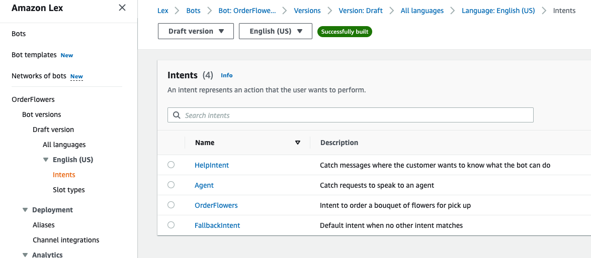
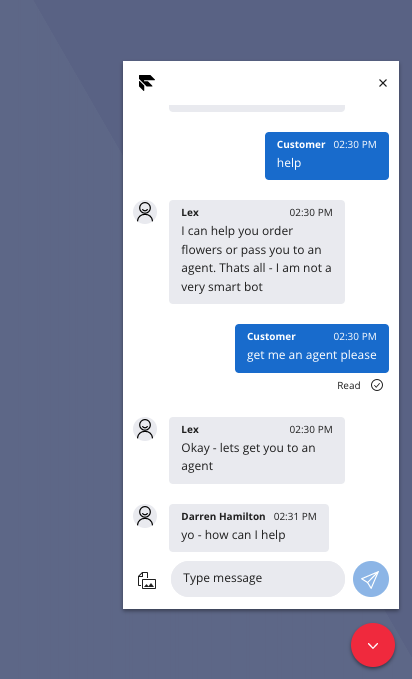

# Flex WebChat integration to AWS Lex

## Disclaimer

**This software is to be considered "sample code", a Type B Deliverable, and is delivered "as-is" to the user. Twilio bears no responsibility to support the use or implementation of this software.**

## Flex UI V1/Legacy Flex Chat with Programmable Chat

**For Flex Conversations the general patterns will still apply but the studio trigger examples and API requests would need changing for Flex Conversations**

# Overview

This repo describes a couple of options on how to integrate Flex WebChat into AWS Lex and provides POC code for Twilio serverless Functions, AWS Lambdas and a Studio Flow.

After describing how to extend the AWS Lex 'Order Flowers' sample bot to include intent indicating 'Chat to Agent' we cover how to integrate the Twilio Flex WebChat widget with Lex.

Option 1 uses a Studio Flow combined with Twilio Functions approach and option 2 describes setting a Flex Flow to point to a Twilio Function and bypassing Studio.

Option 1 is self-contained within Twilio (Twilio Functions, Studio and Lex via AWS lex runtime sdk) whereas option 2 provides a more generic solution that splits the Programmable Chat Channel interaction implemented in Twilio and the Bot specific handling within AWS.

# AWS Lex OrderFlowers Bot Setup

This repo builds on the [OrderFlowers sample](https://docs.aws.amazon.com/lex/latest/dg/gs-bp.html). After building the sample bot and testing it out you can extend it as follows:

- Add an intent named _'Agent'_ with sample utterances phrases along the lines of below. Set the initial response message to something suitable such as _'Okay - lets get you to an agent'_
  - agent
  - talk to a person
  - etc
- Optionally add an intent named _'HelpIntent'_ with the message response along the lines of _'I can help you order flowers or pass you to an agent. Thats all - I am not a very smart bot'_

Once you have built and tested your bot note down the Bot Id and Bot Alias Id that will be used by the [lex-runtime sdk](https://docs.aws.amazon.com/AWSJavaScriptSDK/latest/AWS/LexRuntimeV2.html)

Now that the bot has been extended we will make use of the _'OrderFlowers'_ and _'Agent'_ intent names as follows:

- On _'Agent'_ intent we will send the chat to Flex
- On _'OrderFlowers'_ intent and state is _'ReadyForFulfillment'_ we will close the chat
- On all other intents just pass back any messages from Lex.

Both option 1 and 2 make use of the recognizeText aws lex runtime sdk method and use the response to determine the intent, state and message to reply back to the channel with.
A deeper dive into Lex is outside of the scope of this repo but the recongnizeText request/response is covered in detail [here](<(https://docs.aws.amazon.com/AWSJavaScriptSDK/latest/AWS/LexRuntimeV2.html#recognizeText-property)>)

For this simple POC we make use of the following response fields:

```
sessionState.intent.name
sessionState.intent.state
messages.[0].content (we assume only 1 message per turn)
sessionState.intent.slots
```



# Option 1 - Studio Integration

## Overview of solution

This solutions makes use of a [Twilio Function](studio-approach/serverless/functions/handleMessagesForBot.protected.js) to send customer messages to Lex and it returns the lex runtime recognizeText response to the [Studio Flow](studio-approach/studio-flow/studio-flow.json). The Studio Flow uses the [Send & Wait for Reply widget](https://www.twilio.com/docs/studio/widget-library/send-wait-reply) to send the Bot reply to the customer and waits for a reply message from the customer and will loop around calling the function and then Send & Wait for Reply. Note the Programmable Chat Channel Sid (CHxx) is used as the Lex Session Id.

If the _'Agent'_ intent is reached a [Send to Flex widget](https://www.twilio.com/docs/studio/widget-library/send-flex) is used. After the Send to Flex widget subsequent messages will just go into the programmable chat channel and be available for the agent rather than to the Bot.

Note in the case of _'OrderFlowers'_ and the _'ReadyForFulfillment'_ state a [Twilio Function](studio-approach/serverless//functions/readyForFulfillment.protected.js) is called which updates the programmable chat channels attributes to indicate _status=INACTIVE_ which signals to the Flex WebChat widget to close the chat

## Deploy

- [Deploy OrderFlowers bot](https://docs.aws.amazon.com/lexv2/latest/dg/aliases.html) and note the bot and alias id
- Add AWS user with lex runtime permissions policy for [Amazon Lex](https://docs.aws.amazon.com/lex/latest/dg/security-iam-awsmanpol.html)
- Rename the .env-template in serverless to .env and update the Twilio Sids, AWS credentials and AWS Bot Ids. Environment variables are covered in detail [here](https://www.twilio.com/docs/labs/serverless-toolkit/developing#environment-variables).
- Deploy the Twilio Serverless functions and note the twil.io domain name created. Deploying functions is covered in detail [here](https://www.twilio.com/docs/labs/serverless-toolkit/deploying).
- Create the [Studio Flow](https://www.twilio.com/docs/studio/user-guide/get-started#create-a-flow) from the [Studio Flow JSON](studio-approach/studio-flow/studio-flow.json) or replace the default Chat Flow if appropriate.
- Update the domain name in the Studio Flow in the first widget which sets a variable. This should be set to be the domain name from the deployed service, eg https://lex-serverless-studio-xxx-dev.twil.io
- If you have created a new Studio Flow you will need to create a Flex Flow to map the to Studio Flow as described [here](https://www.twilio.com/docs/flex/developer/messaging/manage-flows)

## Test it out!

We can make use of the demo of Flex WebChat:
https://demo.flex.twilio.com/chat?accountSid=ACxxx&flexFlowSid=FOxxx

Note you will need to add in your account sid and the Flex Flow Sid that is pointing to the Studio Flow deployed above.



## Suggested improvements to the solution

Note that whilst the Bot is processing the recognizeRequest the Twilio Function invocation is active as the request is blocking waiting for a response. It is recommended that Twilio Functions are used when the response time is relatively deterministic and short. This is to avoid having too many concurrent function invocations as the [default limit is 30](https://www.twilio.com/docs/serverless/api#limits)

Whilst the Twilio Functions could be replaced using another form of endpoint (AWS Lambda for example) arguably a non-blocking async pattern would be a better design. This is covered in option 2 below.

The Studio Flow is looking for specific intent names and this could be argued as being tightly coupled with the Lex implementation which also drives us to design decisions shown in option 2.

# Option 2 - Webhook Integration
